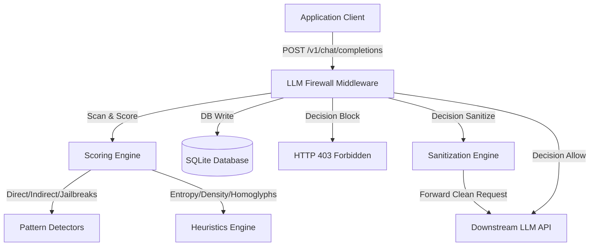

# System Architecture: LLM Prompt Injection Firewall

This document describes the software design, payload flow, database schema, and scoring mechanics of the LLM Prompt Injection Firewall.

---

## 1. System Topology

The firewall sits inline between clients (application backends) and the downstream LLM API provider (e.g. OpenAI). It acts as a reverse proxy, intercepting and sanitizing payloads.

---

## 2. Component Directory Structure

- **`config/settings.py`**: Pydantic Settings validator loading variables from `.env`.
- **`app/middleware/firewall.py`**: Interceptor layer capturing incoming HTTP POST requests to proxy paths, measuring latency, extracting content, triggering the scoring, logging transactions, and enforcing decisions.
- **`app/detection/`**: Contains regular-expression rule modules for checking Direct Prompt Injection, Indirect containment elements (XML/HTML), Jailbreak phrases (DAN/DevMode), data leakage indicators, and Leetspeak/Base64/Hex obfuscation decoders.
- **`app/heuristics/`**: Contains Shannon entropy calculation modules and statistical analysis (mixed script switches, special character counts, nesting depth, and word repetitions).
- **`app/scoring/engine.py`**: Aggregates raw findings and yields a 0-100 score, splitting it into a visual 5-part breakdown (Override, Roleplay, Encoding, Entropy, and Patterns).
- **`app/sanitization/sanitizers.py`**: Normalizes Unicode, strips formatting delimiters, escapes HTML/XML tags, collapses duplicate tokens, and truncates text.
- **`app/dashboard/` & `app/api/`**: Serves page renderers and JSON data streams driving the Bootstrap dark-mode dashboard graphs.

---

## 3. Interception Lifecycle

1. **Request Interception**: Client calls `POST /v1/chat/completions` with Bearer key.
2. **Access Control**: Validates API Key hash against the SQLite database. Checks sliding window rate limit.
3. **Extraction**: Reads prompt text array from body.
4. **Scoring**: Computes total threat score (Max-bias of individual scores and additive breakdown score).
5. **Enforcement Action**:
   - **Learning**: Gathers data, allows request unmodified.
   - **Sanitize**: Cleanse inputs (Unicode flattening, XML/HTML escaping, repetitions collapse), streams modified body.
   - **Enforce**: Returns 403 Forbidden directly if score exceeds block limit (75+), sanitizes if score exceeds warning limit (50+).
6. **Persistence**: Saves records to SQLite (latency, matched rules, IP, raw and clean text).
7. **Downstream Routing**: If allowed, forwards request to OpenAI target or mock completion.
